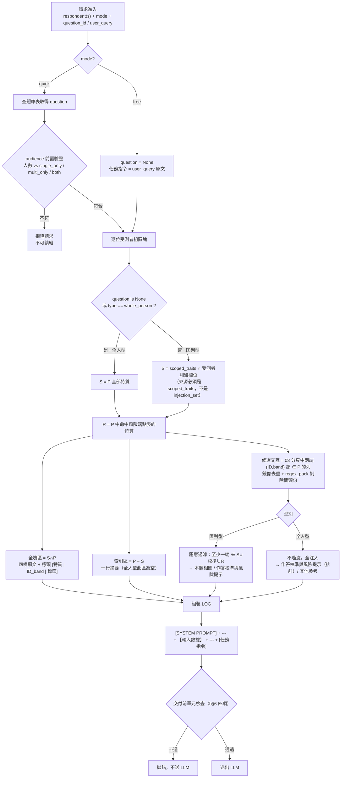
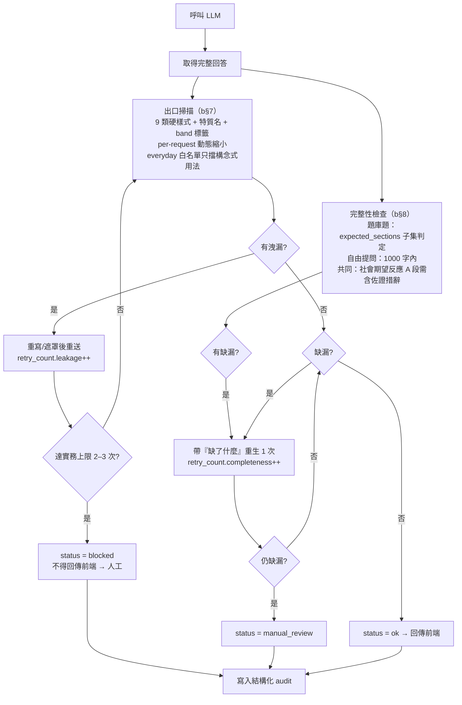

# 17. 四題釐清：快速提問模板改動／匡列型與全人型／風險端點 core-marginal／Prompt-LOG 流程圖

> 本文是對 2026-08-05 提問的四個問題所做的逐題釐清。所有數字均為**實際載入客戶資料檔與 repo 程式碼跑程式驗證**的結果，非文件轉述。
> 對照來源：`docs/0730/Traitty_調整_20260728＿final/`（客戶定版交付包）、`docs/0722 02_08 V6.2 spec_.xlsx`（內容正本）、`BackEnd/api_v2/`（既有實作）。

---

## Q1. 快速提問模板是否需要改動？

**結論：需要，但 60% 的檔案只是「刪掉兩句話」，真正要重寫的只有 4 組題目。**

比對方法：把 `BackEnd/api_v2/config/quick_modules.json` 的 22 個模組（共 40 個 prompt 檔，single/multi）與 `question_injection_table_v9.json` 的 22 題 `instruction_single`／`instruction_multi` 逐行比對（去空白、去空行）。22 題與 22 模組**依 idx 順序 1:1 對齊、標題逐字相同、audience 與 candidate_mode 0 筆衝突**。

### 改動分級

| 級別 | 檔數 | 內容 | 工序 |
|---|---|---|---|
| A. 純刪除 | 24 | 唯一差異是要刪掉「所有說明不得揭露任何測驗資料、特質代碼、分數或心理學術語…」與「提醒：此分析為基於特質所做之…綜合判斷。」兩句 | 機械刪除 |
| B. 潤稿／段號修正 | 12 | v9.2 把數量標註移入句中（「2.主要風險3項：」→「2.主要風險：列出3項，」）；idx 1 面試題原本有**兩個「第四部分」**（既有 bug），v9 修正為第四／第五部分 | 直接換文字 |
| C. 實質改版 | 4 組 | 見下 | 需覆核 |

**A 級為什麼可以刪**：這兩句已被 `a_LOG完成版模板_v2_20260727.md`「【全域輸出規範】（唯一正本，共 20 條；取代各題原本重複的禁止段與判讀規範段）」吸收。題庫 JSON 的 `cleanup.uncertain` 欄位也把被移走的原句逐字記錄下來，可以逐條核對確認沒有誤刪。

### C 級：4 組實質改版

| idx / 模組 | 改了什麼 | 備註 |
|---|---|---|
| 6 `mgmt_style`（合適的管理方式與風格） | v9 換成真正的「個人化管理策略」5 段架構（管理定位／授權尺度／管理節奏／最有效的帶法／容易踩雷的帶法） | **repo 現有檔案內容是溝通策略指南**，與 `team_comm_single.txt` 幾乎逐字相同（583 vs 580 字元）——這是既有的內容錯置缺陷，v9 順便修掉 |
| 9 / 10 `mgmt_manual_mgr` / `mgmt_manual_self`（個人使用說明書） | 補上完整輸出架構（主管版 7 模組、個人版 8 模組），現有檔案只有輸出原則、沒有模組架構；同時**移除 600–700 字／400–550 字硬性字數限制**（v9 明列此為救回項） | 新增行數最多的兩題（+26／+29 行） |
| 15 / 21 / 22（會議團隊／深度領導／深度溝通） | 從「ANI、CIA、SPA 三種評鑑」擴充為**四種（加入 CSR）**，補上 CSR 的判讀角色段落 | 這三題是唯一在指令文字裡寫死測驗清單的題目 |
| 21 / 22（深度分析兩題） | 特質名後補上 trait_id（「CSR_35信任」「ANI_05自主領導」） | 目的是消歧 84 個中文名跨四份測驗的同名構念；ID 只存在於送進去的 payload，出口掃描器仍會攔它出現在回覆中 |

### 除了文字之外，還有兩個結構性改動（所有 40 檔都要做）

1. **刪掉每檔尾端的「【輸出安全防護】」黑名單段**。現在 22 個模組各自維護一份長得很像但不保證一致的禁令清單，改一條規則要改 22 個檔案；新設計是收斂成 System 全域 20 條（事項 07 §2）。
2. **資料佔位符要換掉**。現有 `{base_analysis}` / `{interactions}` 兩個變數，要換成新規格的 `【輸入數據】` 三段式區塊（判讀主體特質／其他特質索引／交互作用子區塊）。

### 正本歸屬（這點會決定日後誰改哪裡）

`question_injection_table_v9.json` 的 `_source_of_truth` 明寫：

> 指令文字（instruction_single/multi）為用戶擁有之正本，以 c xlsx 為準；程式只重生 scoped_traits 等衍生欄位，且覆蓋前必 diff。

也就是說**指令文字的正本是 `c_快速提問重構版_v9_20260728.xlsx`，不是我方的 .txt 檔**。建議建立單向匯入路徑 `c xlsx → question_injection_table JSON → runtime`，我方不要再在 `prompts/modules/*.txt` 上手改文字，否則下一次客戶潤稿又會對不上（這正是現在 idx 6 內容錯置能存活到今天的原因：沒有任何一致性檢查在比對兩邊）。

---

## Q2. 匡列型與全人型如何區分？

**結論：唯一判準是題庫表的 `type` 欄位，不是語意判斷，也不是靠 `scoped_traits` 是否為空來反推。**

```
question["type"] == "scoped"        → 匡列型（19 題）
question["type"] == "whole_person"  → 全人型（3 題）
question is None（mode == "free"）  → 自由提問，走全人型同一條路徑
```

22 題中全人型只有 3 題：**idx 9 個人使用說明書(主管)、idx 10 個人使用說明書(個人)、idx 15 打造高效會議團隊**。這 3 題的 `scoped_traits` 實測為空（且 `injection_set` 也為空），但**不要拿「空集合」當判準**——那是結果不是原因，且自由提問路徑沒有 question 物件可判。參考骨架用的就是 `question is None or question["type"] == "whole_person"`（第 132、207 行）。

### 兩型別在三個地方行為不同

| 環節 | 匡列型 scoped | 全人型 whole_person |
|---|---|---|
| **S 集合** | S = 該題 `scoped_traits` ∩ 受測者已測測驗欄位 | S = P（受測者全部特質） |
| **特質區塊** | 全塊區 = S∩P（四欄原文）＋索引區 = P−S（一行摘要）<br>標頭：`#### 判讀主體特質` | 全部進全塊區、**無索引區**<br>標頭：`#### 判讀主體特質（全人型＝全部特質）` |
| **交互子區塊** | 先做題意過濾（至少一端 ∈ S∪校準∪R），再分：<br>`交互作用——本題相關`<br>`交互作用——作答校準與風險提示`<br>本題相關 1–4 條 → 加尾註；0 條 → 整段不輸出 | **不做題意過濾**，候選全注入，分：<br>`交互作用——作答校準與風險提示`（排前）<br>`交互作用——其他參考`<br>不出現「本題相關」子區塊、無尾註、無截斷 |

兩型別**共同不變**的是：全塊區來源一律是 `scoped_traits`（不是 `injection_set`）；風險特質與校準特質**不因命中而升全塊**，未匡列就留索引區。

### 與既有實作的落差

`BackEnd/api_v2/services/context_builder.py` 目前**沒有型別概念**：不論哪個模組，都是把受測者全部特質一視同仁注入、沒有 S、沒有索引區、沒有子區塊分組。等於現況全部題目都跑在「全人型」行為上，19 題匡列型的題意收斂完全沒有發生。這是事項 05／06 要補的主要缺口。

---

## Q3. 風險端點表的 core / marginal 如何運作？能否整合進 spec xlsx？

### 3.1 core / marginal 在程式裡**完全不作動**

這是最容易誤解的一點。`question_injection_table_v9.json` 的 `risk_endpoints.adopted` 是 **71 個 2 元素陣列** `[trait_id, band]`（實測：所有元素長度皆為 2），**沒有任何級別欄位**。級別只存在於人閱版 `風險端點表_定案_20260727.md` 的「級別」欄。

級別的意義是 2026-07-27 那次裁決的**理由紀錄**：

- `core`：風險機制明確（例：CIA_36_A「反應門檻低，情緒升溫快…當場對抗」）
- `marginal（已裁採用）`：有風險色彩但機制較弱（例：ANI_21_B「僅複雜權力情境需要時間適應」）
- `property_peak 補列`：兩端皆評的補列，僅 **CIA_27_A** 與 **SPA_09_A** 兩筆（權益公平感的「過度讓利端」被裁定為剝削入口，不是無風險）

裁決結果是「**Core＋Marginal＋property_peak 兩端全數採用**」，所以三類在 runtime 行為**完全相同**：一個布林集合成員判定。級別欄的價值是稽核與日後調整（若某天要退回只採 core，資料已經備好），不是分支條件。

### 3.2 端點在流程中只做兩件事

```
R = { trait_id | (trait_id, 受測者該特質的 band) ∈ 端點表 }
```

1. **進入交互選列的過濾集合**：匡列型第 1 步「至少一端 ∈ (S ∪ 校準 ∪ R)」，讓觸及該特質的交互敘事**保證被注入**。
2. **決定交互塊歸到哪個子區塊**：僅因校準/R 入選（兩端都不在 S）的列 → `交互作用——作答校準與風險提示`。

**不做**的事：不影響特質是否升全塊區（明文「風險特質不因此升全塊」）、不改變任何敘事文字、不加註記到輸出。

分布實測：CSR 28 條、CIA 24 條、SPA 16 條、ANI 3 條，涉及 56 個不同 trait_id（同一特質可能 A、B 或 B、C 兩端都入選）。

### 3.3 能否整合進 `0722 02_08 V6.2 spec_.xlsx`：可以，而且很乾淨

實測兩件事都成立：

- 71 個 `(trait_id, band)` 端點，**全部**能在 02 分頁的 339 個 trait-band 列中找到對應列，**0 筆缺漏**。這是一個乾淨的 1:1 join，不需要新增列、不需要對照表。
- 02 分頁目前用到第 19 欄（`version`，索引 18），**第 19–24 欄（T–Y）全部為空**，可直接接一欄上去，不影響既有 `COL` 索引常數。

### 3.4 建議做法：加兩欄 + 改三處程式

> ⚠ **2026-08-05 更新：本節的「在 02 分頁加欄」做法已被取代。**
> 加欄的寫法只能擴充「同一型別的新端點」；一旦要新增**端點型別**（如未來的第三類端點），每種型別都要再加一欄，等於每次都要改 schema 與程式，與「新增端點不必改程式」的初衷矛盾。且風險端點是 (特質, band) 層級、作答校準是特質層級，兩者粒度不同，硬塞進同一張 band 層級的分頁並不自然。
> **實際交付的 `0805 02_08 V6.3 spec_.xlsx` 改用兩張新分頁**：`09_endpoints`（一列一端點，含 `endpoint_type` 欄，`band` 可填 `*` 表特質層級）與 `10_endpoint_blocks`（型別 → 子區塊標頭／順序／衝突優先序）。02、08 兩張分頁因此完全不動。詳見 `docs/0805_V6.3_spec_變更說明_給客戶.md`。
> 資料庫端對應為**新增兩張表**（`endpoint_blocks`／`trait_endpoints`），既有三張表零變動；DDL 見 `BackEnd/scripts/migrations/2026-08-05_add_endpoint_tables.sql`（已於正式庫以執行後回滾方式實測通過）。
> 以下保留原分析作為決策過程紀錄。

**資料面（02 分頁）**

| 新欄 | 索引 | 層級 | 值 |
|---|---|---|---|
| `risk_endpoint_level` | 19 (T) | band 層（逐列填） | `core` / `marginal` / `property_peak` / 空白 |
| `is_calibration` | 20 (U) | trait 層（該 trait 三列填一樣） | `Y` / 空白（僅 CIA_33、ANI_23、SPA_12） |

校準特質建議一併做掉，否則 `{CIA_33, ANI_23, SPA_12}` 又會是一個散在程式常數裡的魔術值，跟端點表分家管理。

**程式面（`BackEnd/scripts/migrate_traits_from_excel.py`）**

1. `COL` 字典加 `'risk_endpoint_level': 19, 'is_calibration': 20`
2. `apply_schema_migration()` 加兩行（該函式已是 `ADD COLUMN IF NOT EXISTS` 的 idempotent 寫法，直接追加即可）：
   ```sql
   ALTER TABLE trait_bands ADD COLUMN IF NOT EXISTS risk_endpoint_level VARCHAR(20)
   ALTER TABLE trait_definitions ADD COLUMN IF NOT EXISTS is_calibration BOOLEAN DEFAULT FALSE
   ```
3. `parse_band_sheet()` 的 bands dict 與 `write_to_db()` 的 INSERT 各加欄位；`BackEnd/api_v2/database/models.py` 的 `TraitBand` / `TraitDefinition` 加對應 Column

**效果**：日後新增／移除端點＝內容方在 xlsx 填一格 → 重跑一次 `migrate_traits_from_excel.py`，**不必改任何程式碼、不必改 JSON、不必發版**。打包器的 R 判定變成一句 SQL：

```sql
SELECT trait_id, band FROM trait_bands WHERE risk_endpoint_level IS NOT NULL
```

### 3.5 兩個必須注意的前提

1. **匯入是 TRUNCATE 全表重灌**（`write_to_db()` 第一步就是 `TRUNCATE trait_interactions, trait_bands, trait_definitions CASCADE`）。所以端點資料一旦入 DB，就**必須**同時存在於 xlsx，否則下一次匯入會被靜默清空。這反而是「應該放進 xlsx」的最強理由——留在外部 JSON 就會變成「特質正本在 DB、端點在 JSON」，兩份版本各走各的。
2. **要加一道匯入後一致性檢查**：匯入完成後斷言 `risk_endpoint_level IS NOT NULL` 的列數 = 71（或內容方核可的新數字），並與 `question_injection_table_v9.json` 的 `risk_endpoints.adopted` 做集合 diff，不一致就報錯、不放行。否則 xlsx 少填一格不會有任何症狀，只會讓某些人的風險交互靜靜地不再保證注入。

---

## Q4. Prompt / LOG 組合流程圖

### 4.1 資料來源與最終落點

| 代號 | 來源檔 | 進到 LOG 的哪一段 |
|---|---|---|
| System 靜態文本 | `a_LOG完成版模板_v2_20260727.md` 第一部分（20 條全域規範） | `[SYSTEM PROMPT]` |
| T1 題庫表 | `c_快速提問重構版_v9.xlsx` → `question_injection_table_v9.json` | `type`/`audience`/`scoped_traits` 決定分流；`instruction_*` → `[任務指令]` |
| T2 風險端點 | `risk_endpoints.adopted`（71 條，**建議改由 02 分頁供給**，見 Q3） | 影響交互選列與子區塊歸屬 |
| T3 校準特質 | `{CIA_33, ANI_23, SPA_12}` | 同上；內容零工序，資料自帶 |
| T4 內容正本 02 分頁 | `0722 02_08 V6.2 spec_.xlsx` | 全塊區四欄 + 索引區行為面向 |
| T4 內容正本 08 分頁 | 同上 | 交互敘事本文 |
| T5 剝除正則 | `regex_pack_v6_2.json` | 剝掉交互敘事開頭句 |
| 受測者資料 | Talent Chat API v2 | `P = {(trait_id, band)}` |

### 4.2 組裝流程（Build）



單元檢查四項：① 全塊數 = |S∩P|、索引行數 = |P|−全塊數；② 每個交互標頭兩端 ID 都出現在全塊區或索引區；③ 全文無 `['`、無空括號（**僅檢查敘事本文欄，必須排除標頭**——標頭的 `XXX_nn` 是合法且必須保留的內部標記）；④ 子區塊歸屬正確。

### 4.3 輸出檢查流程（Guard）



**兩條重試線必須分開計數**（`retry_count.leakage` / `retry_count.completeness`），否則會出現「洩漏重試用完額度，導致段落缺漏沒機會重生」的耦合失真。狀態語意也不同：`blocked` = 仍有洩漏、**禁止回傳前端**；`manual_review` = 段落不完整但無洩漏、內容本身無洩漏風險。

參考骨架 `run_with_exit_guard()`（第 395–404 行）把兩者合成同一次重試，**不符合 b§7「分開計數」的要求，需要改寫後才能用**。

### 4.4 Log 落點對照（三種紀錄，用途不同，不要混為一談）

| 紀錄 | 現況 | 要做什麼 |
|---|---|---|
| `prompts.log`（`rag_engine._log_prompt()`，第 484–497 行） | 記 `[SYSTEM PROMPT]` + `[USER QUERY]` 兩段自由文字 | LOG 改成三段式後格式要同步，否則存的內容與實際送出的對不上 |
| `rag_service.log` | 一般服務日誌 | 不變 |
| **結構化 audit（b§8 要求）** | **完全不存在** | 每次請求都要產出：`question_id` / `audience` / `expected_sections_check` / `calibration_evidence_check` / `leakage_hits` / `retry_count`。`expected_sections` 為空的 3 題（idx 14、15、22）必須 log「本題未做段落齊全檢查（原因：指令未定義固定段落標題）」，**不得無聲通過** |

### 4.5 這張圖上還沒解的一個架構衝突

流程圖 4.3 的前提是「拿到**完整**回答才開始掃描」。但現行 `BackEnd/api_v2/routes/chat.py`（第 391–439 行）是逐 token SSE 串流，等收滿 token 跑完掃描時，使用者瀏覽器上早已顯示完畢，`blocked` 在現行架構下**技術上擋不住**。這是事項 16 待裁定的產品決策（完全緩衝／背景掃描事後補救／只對題庫題緩衝），在決定之前，「有掛出口掃描器」不等於「使用者絕對看不到洩漏內容」。

---

## 對照出處

- `b_打包規則_v2_20260727.md` §1.1、§2、§3、§5、§6、§7、§8
- `a_LOG完成版模板_v2_20260727.md` 第一部分（20 條）、第二部分（區塊樣式）
- `01_設計總說明與決策定案_v2_20260728.md` §3（風險端點 71 條、property_peak 兩端皆評、構念家族不得 runtime 擴張）
- `風險端點表_定案_20260727.md`（71 條人閱版，含級別與裁讀理由）
- `question_injection_table_v9.json`（`risk_endpoints.adopted` / `_source_of_truth` / `injection_note`）
- `02_參考程式碼_打包器骨架.py` 第 126–272、395–404 行
- 既有程式碼：`BackEnd/scripts/migrate_traits_from_excel.py`、`BackEnd/api_v2/services/context_builder.py`、`BackEnd/api_v2/services/rag_engine.py`、`BackEnd/api_v2/routes/chat.py`、`BackEnd/api_v2/config/quick_modules.json`、`BackEnd/api_v2/prompts/modules/*.txt`
- 相關事項：[04](04_module_id與題目對照表.md)、[05](05_特質區塊分流邏輯.md)、[06](06_交互選列邏輯與風險端點表.md)、[07](07_LOG組裝與輸出格式.md)、[09](09_出口掃描器.md)、[12](12_重生與人工轉介流程.md)、[16](16_串流架構與輸出攔截衝突.md)
